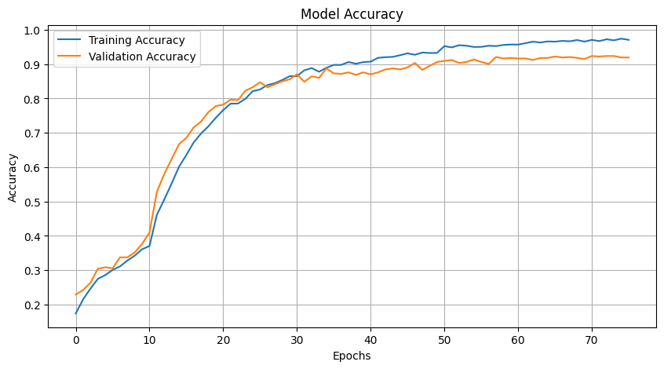
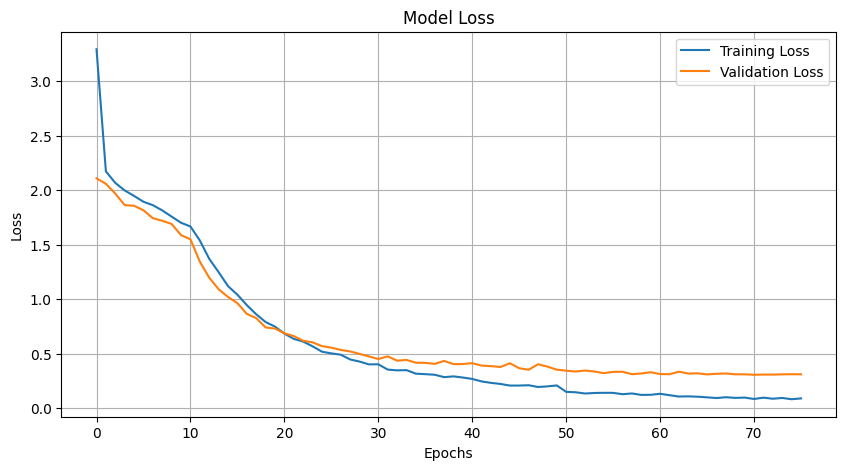
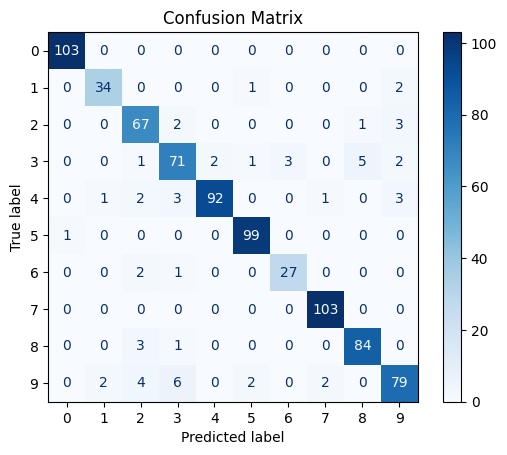

# Sound Analysis Using Neural Networks
### Author: Virendrasinh Chavda

This repository contains a deep learning project for sound classification using neural networks. The project preprocesses audio data, trains a neural network to classify sounds into different categories, and evaluates the model's performance using accuracy, loss curves, and a confusion matrix.

---

## Table of Contents
1. [Overview](#overview)
2. [Installation](#installation)
3. [Features](#features)
4. [Usage](#usage)
5. [Methodology](#methodology)
6. [Results](#results)
7. [Future Work](#future-work)
8. [Contributing](#contributing)
9. [License](#license)

---

## Overview

<p align="justify">
This project is designed to classify audio samples into predefined categories using deep learning. It involves extracting audio features such as MFCCs, training a neural network model, and visualizing performance metrics such as accuracy, loss, and a confusion matrix.
</p>

---

## Installation

To set up and use this project, follow these steps:

1. Clone the repository:
   ```bash
   git clone https://github.com/VirendraChavda/Acoustic-Classification.git
   cd sound-analysis
   ```
2. Launch the Jupyter Notebook:
   ```bash
   jupyter notebook
   ```
## Features

### Neural Network Training
- Built a neural network to classify sounds using extracted MFCC features.
- Utilized advanced training techniques such as:
  - Early stopping.
  - Reduce-on-plateau learning rate adjustment.

### Visualization
- Tracked training and validation accuracy and loss.
- Displayed the confusion matrix to evaluate the classification performance.

---

## Usage

### Data Preprocessing
- Use `Sound Analysis.ipynb` to:
  - Load and preprocess audio data.
  - Extract features such as MFCCs from audio files.

### Model Training and Evaluation
- Train a neural network using the preprocessed features.
- Evaluate the model's performance using metrics like accuracy and loss.

### Visualization
- Plot training/validation accuracy and loss curves.
- Generate a confusion matrix to analyze classification performance.

---

## Methodology

### Steps

#### Data Preprocessing
- Extracted MFCC features from audio data.
- Normalized the features for input into the neural network.

#### Model Architecture
- Designed a fully connected neural network with:
  - Dense layers.
  - ReLU activation functions.
  - Softmax activation for the output layer.

#### Training
- Used categorical cross-entropy loss and Adam optimizer.
- Incorporated early stopping and learning rate reduction on the validation set.

#### Evaluation
- Visualized accuracy and loss curves.
- Analyzed classification results with a confusion matrix.

---

## Results

### Accuracy and Loss
- The model achieved high training and validation accuracy:
  
  

### Confusion Matrix
- The confusion matrix highlighted the model's ability to classify most categories correctly:
  

---

## Future Work

### Model Improvements
- Experiment with Convolutional Neural Networks (CNNs) for feature extraction.
- Use data augmentation techniques to enhance the dataset.

### Feature Engineering
- Extract additional features such as chroma or spectral contrast.

### Deployment
- Deploy the model as a web or mobile app for real-time sound classification.

---

## Contributing

Contributions are welcome! Feel free to fork the repository, make improvements, and submit a pull request. If you encounter any issues, open a GitHub issue for discussion.

---

## License

This project is licensed under the MIT License. See the [LICENSE](./LICENSE) file for more details.
